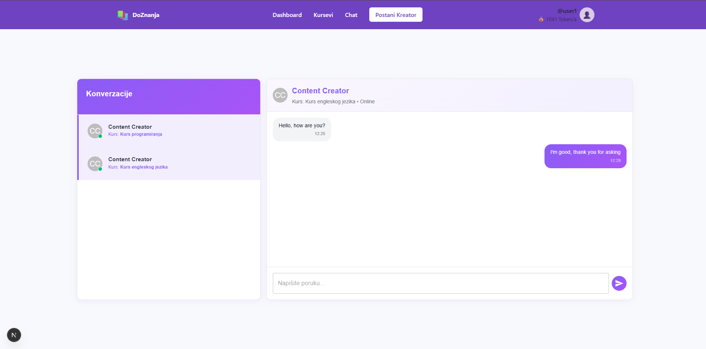
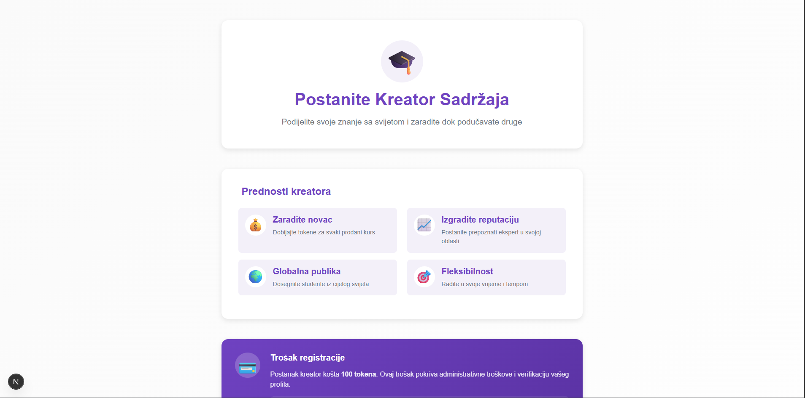
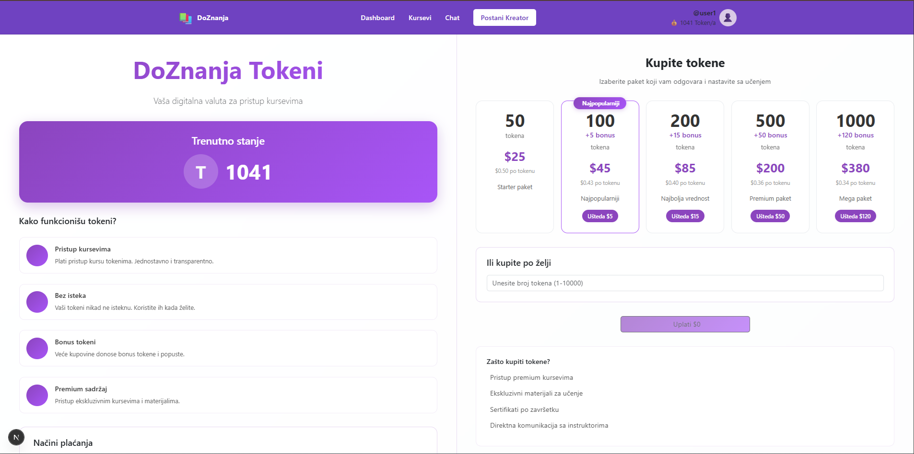
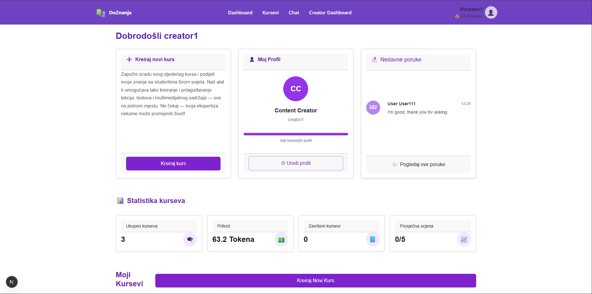

# DoZnanja


**DoZnanja** je web platforma za online učenje inspirisana sistemima poput **Udemy-a**, razvijena kao timski projekat. Platforma omogućava korisnicima da kupuju kurseve, pristupaju edukativnom sadržaju, postaju kreatori kurseva, rješavaju kvizove provjere znanja i komuniciraju putem integrisanog chat sistema.

Poseban fokus projekta je na internom **token sistemu**, gdje korisnici kupuju tokene pravim novcem i zatim ih koriste za kupovinu kurseva i pristup premium sadržaju.

## Ključne funkcionalnosti

### Kupovina i pohađanje kurseva
- pregled dostupnih kurseva
- pristup detaljima kursa
- kupovina kurseva pomoću tokena
- pristup kupljenim kursevima i sadržaju

### Token sistem
- kupovina tokena pravim novcem
- korištenje tokena za kupovinu kurseva
- različiti paketi tokena
- interna ekonomija platforme za pristup sadržaju

### Creator sistem
- korisnici mogu postati **content creators**
- kreiranje i objava vlastitih kurseva
- upravljanje sadržajem kursa
- pregled statistike i aktivnosti na creator dashboardu

### Kvizovi i provjera znanja
- kvizovi nakon završenih lekcija ili kurseva
- pitanja kreira kreator sadržaja
- dodatna provjera razumijevanja gradiva

### Chat funkcionalnost
- komunikacija između korisnika i kreatora
- jednostavan sistem razmjene poruka unutar platforme

---

## Tehnologije

### Backend
- **FastAPI**
- **Python**
- **PostgreSQL**
- **SQLAlchemy**

### Frontend
- **Next.js**
- **React**
- **Material UI**

### Ostalo
- REST API
- Git & GitHub
- slojevita organizacija projekta


## System Architecture

Platforma je razvijena kao full-stack web aplikacija sa jasno odvojenim slojevima.

User (Browser)
      ↓
Frontend (Next.js / React)
      ↓
REST API
      ↓
Backend (FastAPI)
      ↓
Database (PostgreSQL)

Frontend komunicira sa backendom putem REST API poziva,
dok backend upravlja poslovnom logikom, autentifikacijom,
token sistemom i komunikacijom sa bazom podataka.
---

## Arhitektura projekta

Backend dio aplikacije organizovan je kroz slojevitu strukturu:

- **controllers** – obrada HTTP zahtjeva
- **services** – poslovna logika aplikacije
- **repositories** – komunikacija sa bazom podataka
- **models** – definicija entiteta baze
- **schemas** – validacija ulaznih i izlaznih podataka

Ovakva organizacija omogućava pregledniji kod, lakše održavanje i jednostavnije proširenje funkcionalnosti.

---

## Primjer toka korištenja platforme

1. Korisnik registruje nalog i prijavljuje se na platformu  
2. Kupuje tokene pomoću dostupnih paketa  
3. Tokenima kupuje željeni kurs  
4. Prati lekcije i edukativni sadržaj  
5. Nakon završetka rješava kviz provjere znanja  
6. Po želji može postati kreator i objaviti vlastite kurseve  
7. Komunicira sa drugim korisnicima ili kreatorima putem chata  

---

## Screenshotovi aplikacije

### Chat sistem


Komunikacija između korisnika i kreatora kurseva unutar same platforme.

### Postanite kreator sadržaja


Poseban dio platforme omogućava korisnicima da postanu kreatori sadržaja i objavljuju vlastite kurseve.

### Token sistem


Korisnici kupuju tokene pravim novcem i koriste ih za pristup kursevima i premium sadržaju.

### Creator dashboard


Kreatori imaju pregled svojih kurseva, statistike i osnovnih aktivnosti kroz poseban dashboard.

---

## Pokretanje projekta lokalno

### Backend

```bash
cd backend
pip install -r requirements.txt
uvicorn main:app --reload
```
###Frontend

cd frontend
npm install
npm run dev

O projektu

DoZnanja je razvijen kao timski projekat sa ciljem da objedini više važnih aspekata moderne edukativne platforme:

online učenje

monetizaciju sadržaja

interakciju između korisnika

kreiranje vlastitih kurseva

provjeru znanja kroz kvizove

Projekat predstavlja spoj full-stack razvoja, rada sa bazom podataka i organizacije složenijeg sistema sa više korisničkih uloga i funkcionalnosti.

GitHub

GitHub profil: AleksS13
